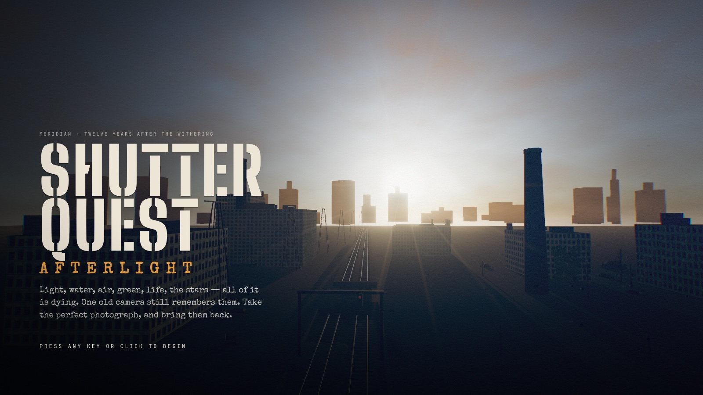
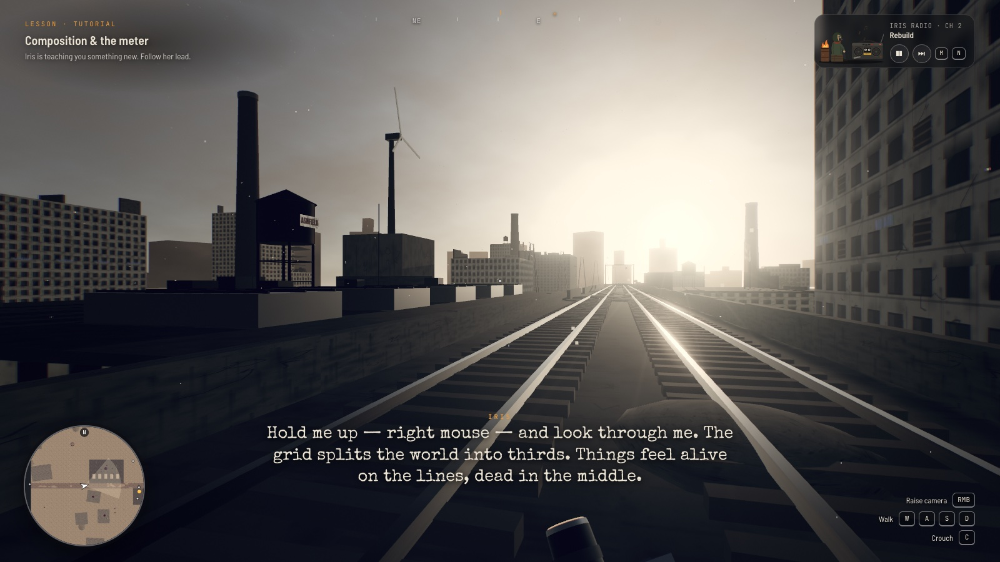
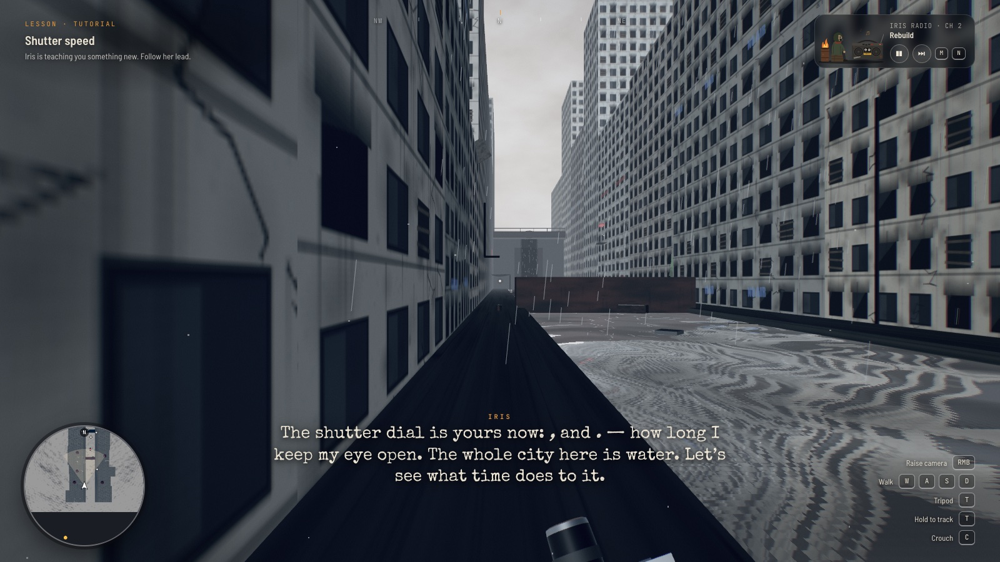
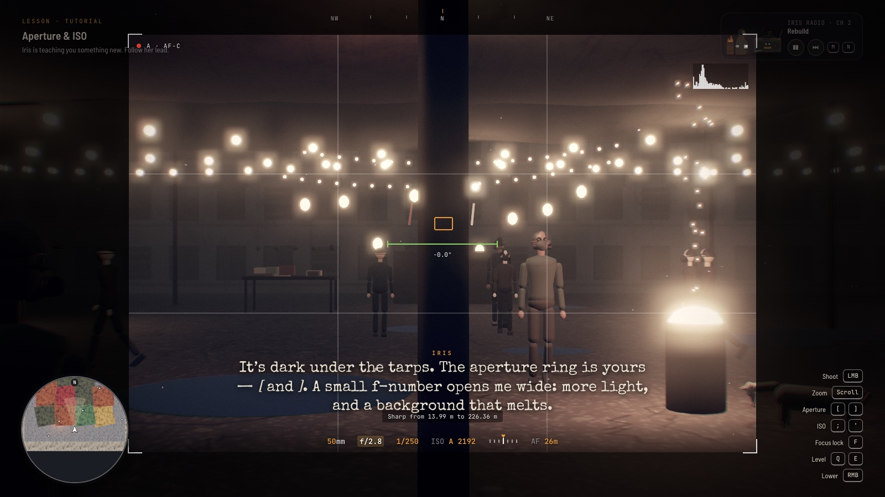
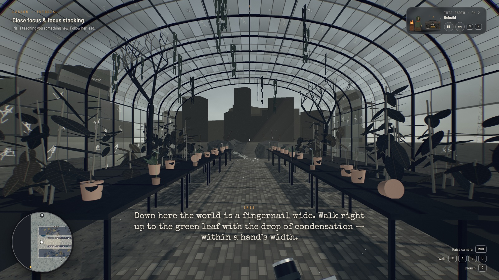
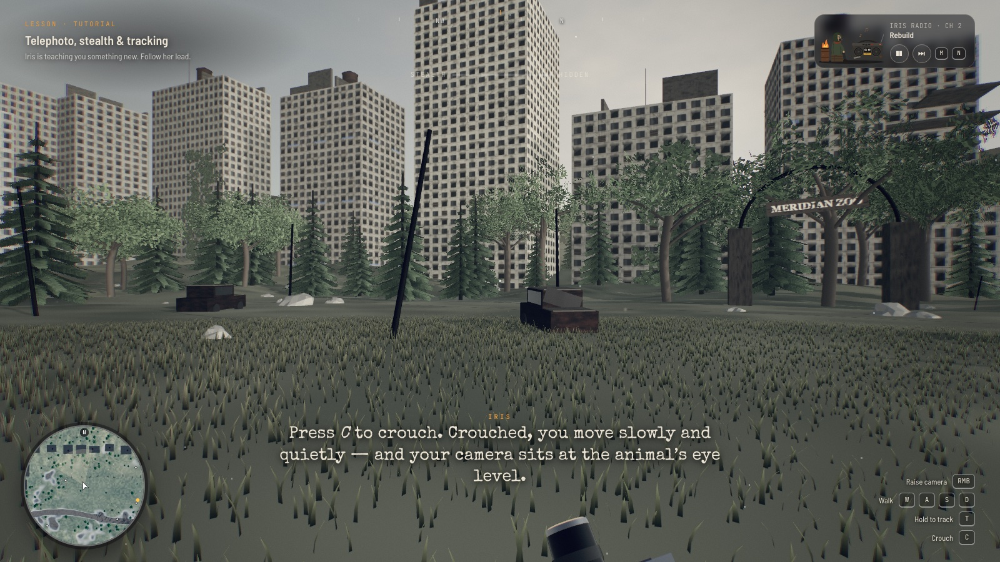
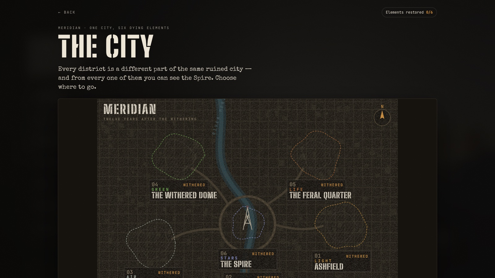
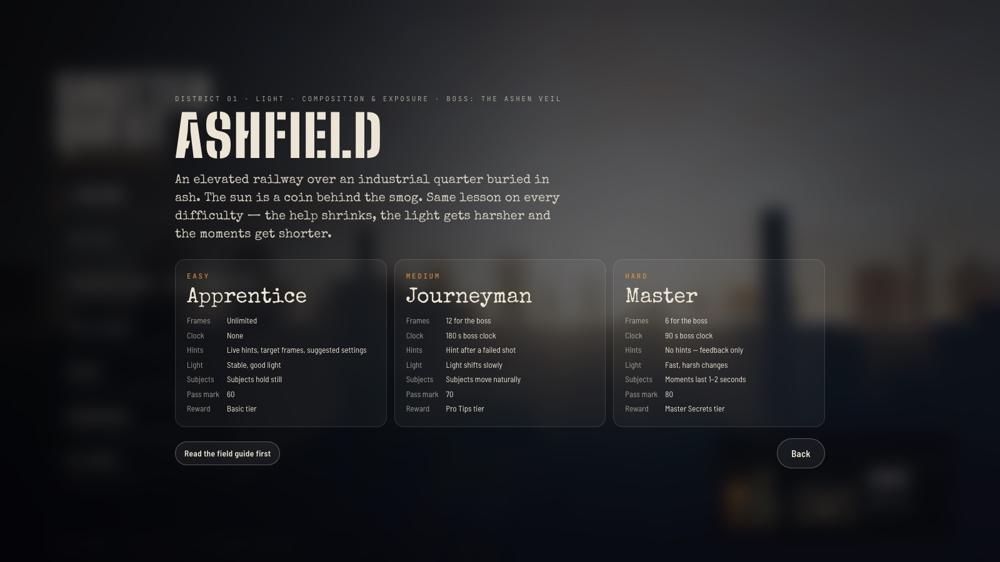
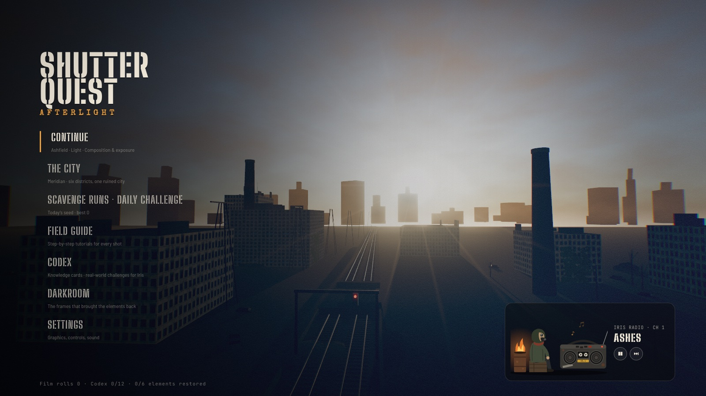
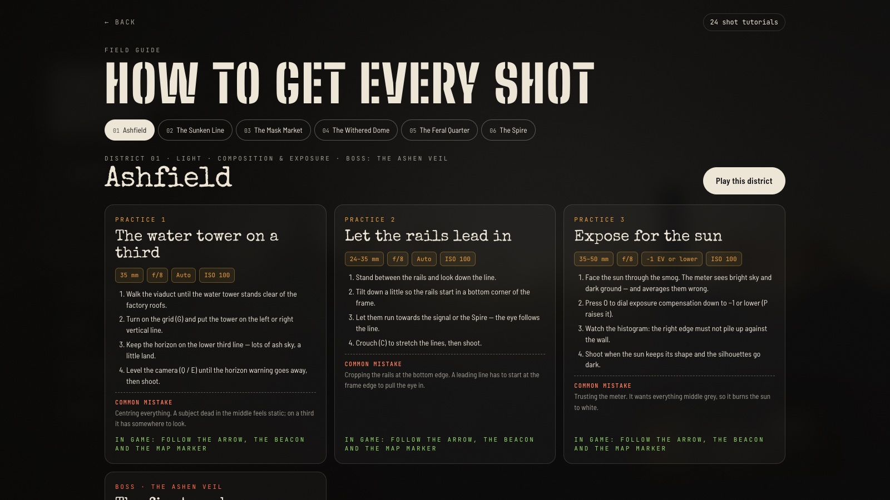

# Shutter Quest: Afterlight

A 3D photography game that runs in the browser. It's Meridian, twelve years after the Withering. Light, water, air, green, life and the stars are all dying, and one old camera, Iris, still remembers them. Walk through six districts of the ruined city, learn one camera skill in each, and bring each element back with the perfect photograph.



| # | District | Element | Skill | Genre | Boss |
|---|----------|---------|-------|-------|------|
| 1 | Ashfield | Light | Composition & exposure | Landscape | The Ashen Veil |
| 2 | The Sunken Line | Water | Shutter speed | Water & weather | The Stillwater |
| 3 | The Mask Market | Air | Aperture & ISO | Portrait & low light | The Choke |
| 4 | The Withered Dome | Green | Close focus & stacking | Macro | The Blight |
| 5 | The Feral Quarter | Life | Telephoto & stealth | Wildlife | The Hollow |
| 6 | The Spire | Stars | Long exposure & full manual | Night & astro | The Last Dark |

Each district has three difficulty levels (Apprentice, Journeyman, Master). There's a field guide with step-by-step tutorials for all 24 shots, a codex of 12 knowledge cards that each end with a challenge for a real camera or phone, and a darkroom for the frames that brought the elements back. Scavenge runs and a daily challenge open once the stars are back.

## Screenshots

| Ashfield · light | The Sunken Line · water |
|---|---|
|  |  |

| The Mask Market · air | The Withered Dome · green |
|---|---|
|  |  |

| The Feral Quarter · life | The city of Meridian |
|---|---|
|  |  |

| Pick a difficulty | Main menu |
|---|---|
|  |  |



## Play

The whole game is one file, `index.html`. Open it in a desktop browser with WebGL 2 (Chrome, Edge, Safari or Firefox). It loads three.js and fonts from a CDN, so it needs an internet connection.

To serve it locally:

```bash
python3 -m http.server 8000
```

Then open http://localhost:8000.

Progress is saved in the browser's local storage. The leaderboard and a few AI-assisted features only work when the game runs as a claude.ai artifact; everywhere else they are skipped.

## Controls

| Key | Action |
|-----|--------|
| W A S D | Walk (Shift to run, C to crouch) |
| Mouse | Look (click the view to capture the mouse) |
| Right mouse | Hold to raise the camera (R toggles) |
| Left mouse / Space | Shoot |
| Scroll | Zoom (Shift+scroll or Z / X for manual focus) |
| [ ] | Aperture |
| , . | Shutter speed |
| ; ' | ISO (I for auto ISO) |
| F | Interact, focus lock, AF / MF |
| K | White balance (V flash, U white card) |
| T | Tripod or tracking (Y focus stack) |
| Q E | Level the horizon (G grid, H hide HUD) |
| M | Music (N next track) |
| Esc | Pause |

Touch controls appear on phones and tablets.
